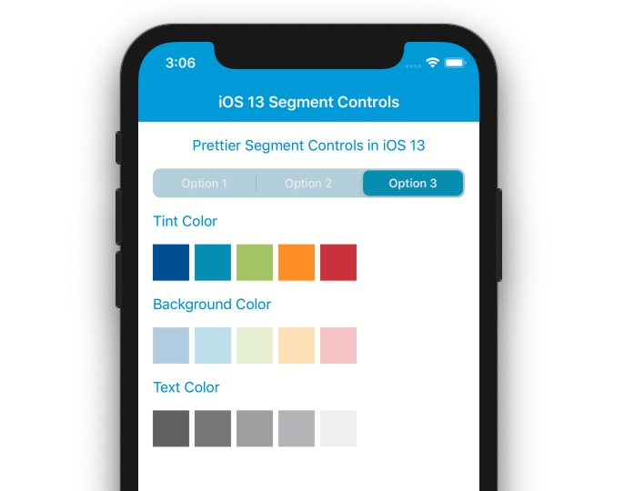

# Introduction 

This solution contains a working example of styled segmented controls in iOS 13 with Xamarin.Forms.
# Outcome



# Usage 
```csharp
using System;
using PrettierSegmentControlsInIos13.Controls;
using PrettierSegmentControlsInIos13.iOS.Renderers;
using UIKit;
using Xamarin.Forms;
using Xamarin.Forms.Platform.iOS;

[assembly: ExportRenderer(typeof(CustomSegmentedControl), typeof(CustomSegmentedControlRenderer))]
namespace PrettierSegmentControlsInIos13.iOS.Renderers
{
    public class CustomSegmentedControlRenderer : SegmentedControl.FormsPlugin.iOS.SegmentedControlRenderer
    {
        protected override void OnElementChanged(ElementChangedEventArgs e)
        {
            try
            {
                if (e.OldElement != null) { return; }

                base.OnElementChanged(e);

                if (Control != null)
                {
                    if (UIDevice.CurrentDevice.CheckSystemVersion(13, 0))
                    {
                        Control.SelectedSegmentTintColor = Element.TintColor.ToUIColor();
                        Control.BackgroundColor = Element.BackgroundColor.ToUIColor();

                        Control.SetTitleTextAttributes(new UITextAttributes { TextColor = Element.SelectedTextColor.ToUIColor() }, UIControlState.Selected);

                        // Note: In a real example this would likely be a global value and not the SelectedTextColor but for the purposes of this example we're just setting both to the same
                        Control.SetTitleTextAttributes(new UITextAttributes { TextColor = Element.SelectedTextColor.ToUIColor() }, UIControlState.Normal);
                    }
                }
            }
            catch (Exception ex)
            {
                System.Diagnostics.Debug.WriteLine(ex);
            }
        }

        protected override void OnElementPropertyChanged(object sender, System.ComponentModel.PropertyChangedEventArgs e)
        {
            base.OnElementPropertyChanged(sender, e);
            
            if (Control == null || Element == null) return;

            // Leave everything as defaults for pre iOS 13
            if (!UIDevice.CurrentDevice.CheckSystemVersion(13, 0)) { return; }

            switch (e.PropertyName)
            {
                case nameof(CustomSegmentedControl.TintColor):
                    SetTintColor();
                    break;

                case nameof(CustomSegmentedControl.BackgroundColor):
                    SetBackgroundColor();
                    break;

                case nameof(CustomSegmentedControl.SelectedTextColor):
                    SetTextColor();
                    break;
            }
        }

        private void SetTintColor()
        {
            Control.SelectedSegmentTintColor = Element.TintColor.ToUIColor();
        }

        private void SetBackgroundColor()
        {
            Control.BackgroundColor = Element.BackgroundColor.ToUIColor();
        }

        private void SetTextColor()
        {
            Control.SetTitleTextAttributes(new UITextAttributes { TextColor = Element.SelectedTextColor.ToUIColor() }, UIControlState.Selected);

            // Note: In a real example this would likely be a global value and not the SelectedTextColor but for the purposes of this example we're just setting both to the same
            Control.SetTitleTextAttributes(new UITextAttributes { TextColor = Element.SelectedTextColor.ToUIColor() }, UIControlState.Normal);
        }

    }
}
```